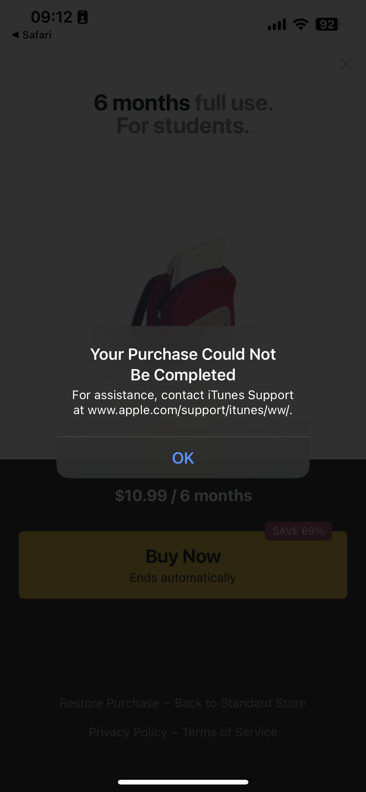
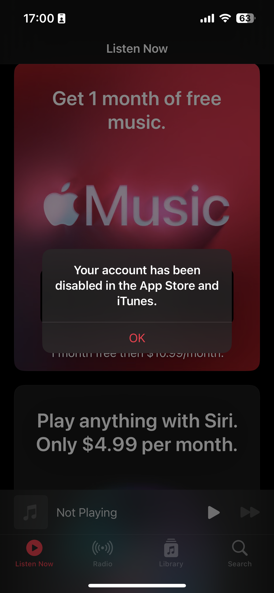
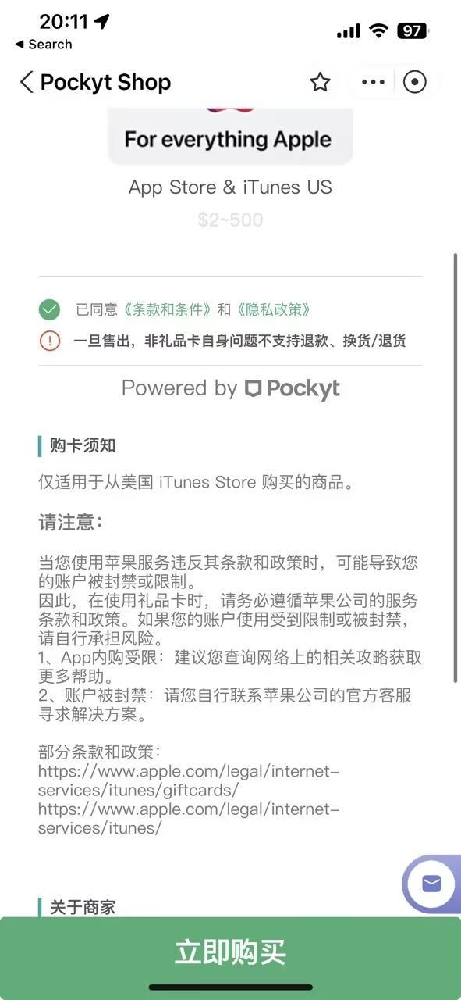
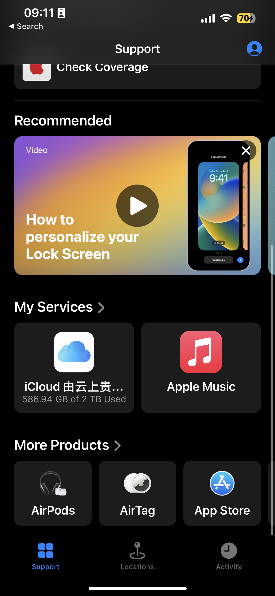
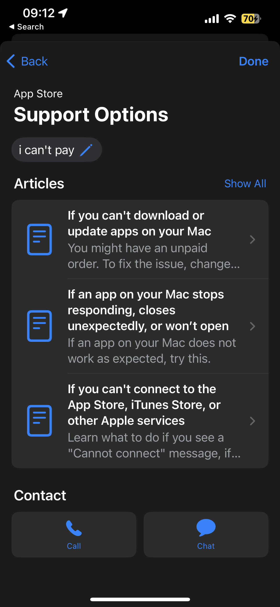
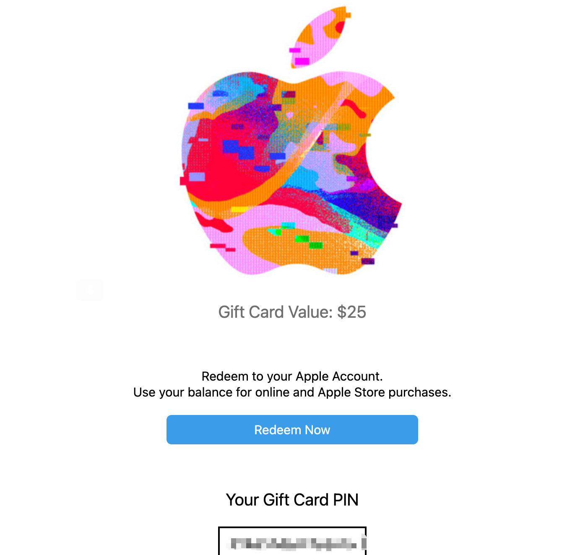

 支付宝购买的礼品卡可能有问题，充值chatGPT plus的同学请小心！

TL，DR：首先承认这个有点标题党，不过我也确实被支付宝骗了，付出的代价就是用了很久的美区Apple账号被永久封禁，礼品卡中的钱无法退回，以及所有通过美区id下载的app均需要重新下载，无法更新。幸好该美区id绑定的服务不多，不然就凉凉了

如果还想通过支付宝购买礼品卡充值chatGPT plus的同学慎之又慎，已经支付宝充值了礼品卡的同学后续再用礼品卡消费遇到问题一定不要去找客服，不然很有可能面临和我相同的经历，账号里剩余的钱能用掉最好，最好是建议重新注册美区Apple id，走官网买礼品卡的方式开通/续费

 账号被封经过

首先解释下Apple的账号，可以分为两类，
1. 一类是登录系统的账号，即设置界面你登录的账号，一般会选择国内的Apple id登录
2. 另一类是用于订阅、购买app的账号，即App Store登录的账号，同时Apple Music、Apple tv、Apple News、Apple Arcade等订阅服务也会共享App Store账号（也就是我此次被封的账号）

 第一次联系客服

起因是我想消费下从支付宝充值的礼品卡余额，于是接收到了提示，付款不成功，让我联系客服

<!--  -->

这时候联系客服，客服说帮你恢复了下，24小时之后尝试

 第二次联系客服

后来到下午，我又看了下，发现这时候自己的账号已经被 `disabled`了，

<!--  -->

再次找客服联系，客服说你的账号已经被封禁了，违反了如下条款，接着就发了我一个Apple的条款链接…

我说那你告诉我到底违反了哪条？

客服回复他看不到，事实上这个账号他的权限无法查询到。

我继续追问那请你找有权限能查看的人来操作，`like advanced customer service`

于是客服给我联系了高级客服，问了我所在地时区和手机号，接着等高级客服电话

 联系高级客服

接电话的是个外国小哥，首先确定我能不能说英语/😂，听口音其实有点像印度小哥

我首先还是很礼貌的，询问自己的Apple account 为什么会被 disabled

然后客服说我帮你查下，wait 1\~2 minutes

结果查完后，客服一直说，`Unfortunately, xxxxxx, xxxxxxx, gift card` （记不住了大概就这些）

果然是礼品卡的问题，虽然有个单词我没听清。

我后面argue了半天， `I didn't realize balabala` ，结果回复就是不行…

最后我索性直接问了 `lots of people have bought gift card from Ali Pay, You mean all of their account will be disabled?`

客服回： ` i can't answer the question..`

后面我想再上升，询问有没有更高级的客服，客服说我帮你去找，让我等

但是等了很久也没有回音，索性挂断了…

 支付宝的购买界面

这时候我回头看支付宝的礼品卡购买界面时，发现人家早就明牌了，责任撇的一干二净…

<!--  -->

后来发现 `v2ex` 上早已有相关的讨论

[https://www.v2ex.com/t/941721] 

也有一些相关帖子，底下的评论也有在说找客服账号被封的经历

[https://v2ex.com/t/941327 ]
[https://www.v2ex.com/t/941147]

 为什么礼品卡会有问题？

虽然很多人都说第三方购买礼品卡会有问题，balabala的，但是都没说清楚为什么会存在问题，于是问问了chatGPT，总结了下：

信用卡被盗/欺诈 -> 被用于大量购买礼品卡 -> 第三方售卖 -> 被盗/欺诈行为被发现 -> 信用卡公司追查 -> 被非法购买的礼品卡会被冻结/作废 

我很好奇，难道信用卡公司能查的这么精细吗，每一笔钱的流向都一清二楚？

chatGPT: 
当信用卡被非法使用购买礼品卡时，信用卡公司和相关执法机构可能会尝试追踪这些非法交易。这可能包括查看交易记录、网络IP地址、电子设备信息等，以找到可能的线索。
然而，这个过程可能非常复杂，也可能有时无法追踪到犯罪者。而且，一旦这些礼品卡被使用或者销售给其他人，就更难追踪了。因此，虽然有可能追踪这些非法购买的礼品卡，但并不总是成功。

 如果不小心购买并消费了有问题的礼品卡，算违法吗？

那如果购买的礼品卡有问题，在我不知情的情况下，算违法吗？

chatGPT:
在大多数司法管辖区，只有在知道或有理由应该知道礼品卡是非法获取的情况下购买这些卡，才会构成违法行为。这被称为"有罪意"或"有过错"的购买。

然而，即使你无意中购买了非法获取的礼品卡，你仍然可能会面临一些问题。首先，这些卡可能会被冻结或作废，这意味着你可能无法使用这些卡。其次，如果这些卡被冻结或作废，你可能很难或者无法从卖家那里得到退款。此外，如果执法机构在调查这种非法活动时发现你购买了这些卡，他们可能会联系你进行询问。

因此，为了避免这些问题，最好的策略是只从苹果或者其官方授权的零售商处购买礼品卡。如果你不小心购买了非法获取的礼品卡，你应该立即向执法机构和信用卡公司报告这种情况，并尽可能提供有关卖家的信息。

 tips 一些经验

 Apple客服联系

我搜索看到很多关于Apple Store问题解决的办法都是寻找客服，但是这些文章又有一个共同点，那就是不告诉你怎么去联系...

AppStore搜索下载 `support` 或者 支持 app（我系统为英文,，所以app名字为support）

或者访问如下链接，跳转到App Store打开
[https://apps.apple.com/hk/app/apple-%E6%94%AF%E6%8F%B4/id1130498044] 

接下来在app界面中往下翻选择有App Store图标的按钮，直接输入你查询的问题，我一般是直接输入 `I can't pay` 

<!--  -->

这时，就会有一个 `chat`的按钮，点一下就能进入人工客服排队了（Apple的人工客服响应还是很快的）

<!--  -->

 转高级客服

上文联系到的客服还只是普通客服，很多时候权限不够，如果还想继续上升的话，告诉他你想联系 `senior advisor`，告诉客服你在中国，手机号是 `(+86) xxxxx` 即可，客服会和你预约时间的（一般久十几分钟之后），接下来就准备好全英文对话吧！

 官网如何购买Apple 礼品卡
既然吸取了血的教训，再也不从第三方渠道（支付宝、淘宝）购买礼品卡了，那么如何从官网购买礼品卡呢？

访问：[https://www.apple.com/shop/gift-cards] 

1. 选择金额，最后一个框是可以输入购买金额的
2. 发送人和接受人可以都填自己的同一个邮箱
3. 支付方式可以选择visa卡/虚拟信用卡/银联（不过我只尝试了虚拟信用卡成功了）
4. 一般十几分钟内，邮箱就能接收到兑换码，如图

<!--  -->

 虚拟信用卡

虽然我很早前就注册了depay账号，但是也没有开卡，更懒得去折腾充值usdt，结果没想到depay已经禁止注册开户了。

但是同事亲测，depay的卡可以来绑定美区Apple id的payment，这样就可以绕开openAI的风控（当然如果Apple也风控的话，可以尝试去注册美区PayPal）

虽然depay停止注册了，但是还有其他的虚拟信用卡可以代替，比如我尝试的nobepay，[https://www.nobepay.com/] 支持微信支付直接转账，不需要搞区块链之类的，但是有几个坑点
- 第一次充值必须是500以上
- 开一张卡的费用是1美刀
- 退款贼麻烦

本着人人为我，我为人人的思想，最开始尝试了一波，开了一张卡，但无法通过openAI的校验，尝试绑定Apple payment支付，也失败了...都计划着这点钱就洒洒水吧，结果过了没多久又可以绑定Apple payment了（估计是过了风控期吧）

 一点思考

后面同我妈讨论这个事情，她第一反应是你不要被骗了，不要转账啥的。我开始还觉得她有点过分担心了，但是仔细一想，我所经历的这些步骤，中间其实存在很多的问题。哪一步有跟同事/朋友/家人联系过？在其他同事眼中你可能就是接了几个电话，操作了几下手机。
幸好我平常对于Apple的服务使用的比较多，相关流程也还算清楚。若是其中有不怀好意的人，故意诱导你，那我会不会为了解封自己的苹果账号而陷入电信诈骗呢，这样往下想着，惊出了一身冷汗，原来电信诈骗真的离我们不远。

有几个教训吧，也分享下：

1. 涉及到钱的事情一定不要嫌麻烦，没有一劳永逸的办法
2. 平台的权力真的太强了….数字时代，订阅时代，吾等小民瑟瑟发抖
3. 看别人的经验贴，底下的评论一定要细看，如果我很早看到那条评论的话…或许账号也不会封的那么快

<!--  -->