 构建个性化的数字日记：自动化工作流实现信息聚合


 开篇

互联网现在仿佛已成为了一个赛博空间的战场，每个app各自为政，你圈一块地，我割一块土。旗帜鲜明，以邻为壑。颇有一种春秋战国的魅力

这让我想起一个故事，近代德国未统一之前，一个运货的商人，途径各个关隘，所交的税，已经是他所贩卖商品价值的好几倍了

对于生活在赛博空间的我们，不也就是这个商人吗，我每天在B站投币，在网易云听歌，在微信看公众号，在YouTube点赞, 以及浏览器中散乱的永远也不会打开的书签与稍后阅读，注意力和时间就是我们所交的税。

Reorx把我们比作赛博空间的信息过滤器，每天接受大量的输入，过滤出自己想要的信息。这个比喻略有一点恐怖，但事实就是如此。

信息输入的太多，看上去我们点赞、收藏、标记了很多东西，结果到头来发现自己已经忘了信息是从何处而来的。

我们需要一个收纳、汇总的地方，我称之为赛博空间的数字日记

本文将介绍这个话题，并一步步指引你如何实现这个步骤

 聚合什么信息

 展现形式

首先介绍这个汇总的地方，我选择的是telegram：

Telegram有很多让我兴奋的点：
- 创建属于自己的频道，类似微信公众号，且没有任何内容审查
- 消息支持的样式丰富，链接会自动预览，标签功能可以快速搜索
- Instant View功能，可以快速地加载一篇文章，并且离线存储
- 好玩的机器人与丰富的API支持

当我把自己使用过的app上的记录都汇总起来，就沉淀了出如下的一个频道： Raye’s Journey(raye的日记)[https://t.me/RayeJourney](https://t.me/RayeJourney)

欢迎join 👏

<p align="center">
  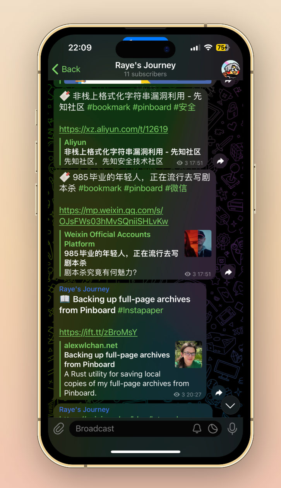
  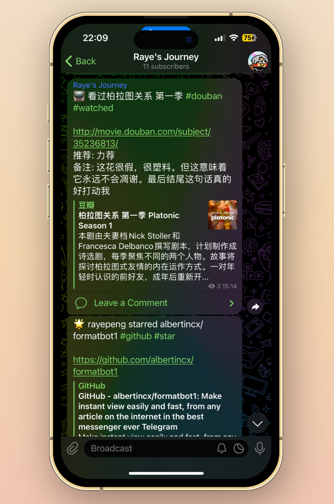
</p>

 内容来源

我梳理了日常生活用到app or 信息来源：
- 阅读：微信读书（通过豆瓣记录）、博客论坛(medium、xlog，通过pinboard+instapaper记录)
- 视频：YouTube、B站
- 追剧：日常在Apple tv、Netflix、hbo上追剧，豆瓣记录
- 音乐：Spotify、网易云
- 社交：微信、telegram、Twitter
- 游戏：xbox、steam、taptap

经过梳理，其实信息源可以来自几个地方：
bilibili、YouTube、网易云、Spotify、豆瓣、pinboard书签、instapaper稍后阅读、Twitter

微信什么的就别想了，隔离的太死了，我也不想和它玩

 自动化工作流

市面上其实已经有很多成熟的自动化工作流平台了，如IFTTT、Zapier等

为了不让读者一开始上来就被繁琐的步骤给搞晕，我们可以先从一个IFTTT开始配置一个工作流

我经常会阅读medium上的文章，并且点赞或者加入稍后阅读

因此，我想实现一个，当我点赞了medium上的文章，我想自动同步到我的telegram频道上

IFTTT，这个网站的命名很有意思，是 `if This, Then That` 的缩写，直译即为：如果这个，那么那个

如果我点赞了medium的文章，那么自动发送到telegram频道上


点击 `if This` ，搜索 medium， 选择第一个（即点赞），这个时候有一个链接你的账户过程，点两下就好了


<!-- 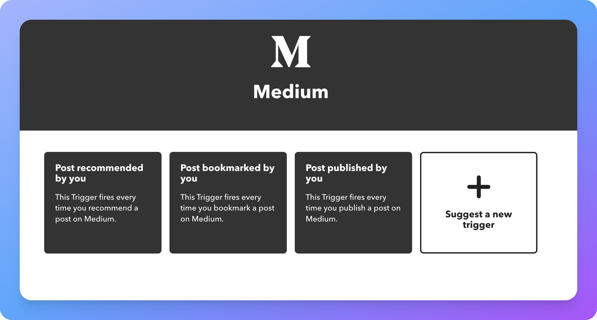 -->


添加好 `if This`之后，再选择 `Then That` ，搜索telegram，添加

这时候需要添加telegram账户，以及目标聊天群或者是频道（如果不知道怎么tg频道的chatid怎么获取，可以参考后面的附录


<!--  -->


最后完成品如下：


<!-- 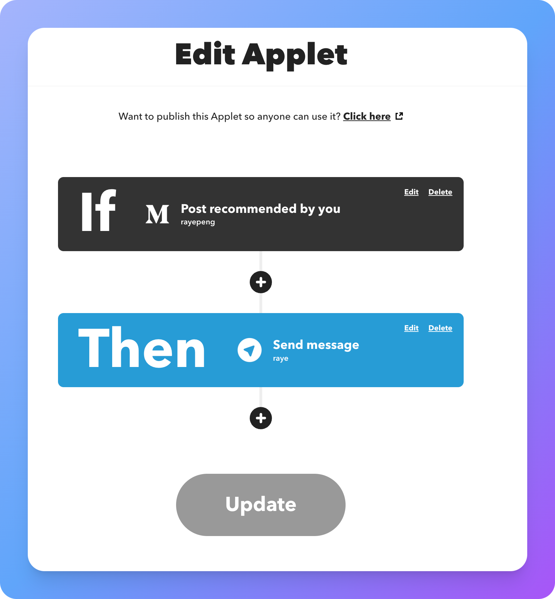 -->


此时，只要我们点赞了一篇medium上的文章，就会自动发送到telegram频道上保存起来

既然IFTTT这么好用，为啥不直接用呢？
因此存在如下问题：
- 付费，免费用户只能创建两个工作流，且处处受限（比如Twitter的一些功能）
- 看平台的支持度，缺乏自定义空间
- 不可控，万一平台跑路，一切都没了🫠

鉴于此，程序员自然要有开源（白嫖）的精神，接下来介绍的内容涉及一些比较繁琐的步骤，但是如果按照步骤来也能轻松地完成😉


 开源的n8n

n8n即是一个开源的工作流平台，虽然本身也提供付费功能，但毕竟给了我们自己部署的空间

n8n本身有一些简单的概念，很类似低代码平台：
- workflow : 工作流，比如你想让网易云的喜欢的音乐自动推送到telegram，可以理解为你想实现自动化的一个事情
- node：节点，即workflow拆解出的一个个步骤，比如上述可以分成几个节点，获取网易云喜欢的音乐，处理数据，推送
- credential：凭证，为了保护用户数据，不可能随便拉取任何一个人的信息，因此需要使用到你的用户凭证

要部署一个服务，自然就得有云服务器，但是现在都流行serverless的部署方式，即不需要接触到底层的服务器，只需要打包好你的应用即可。

 部署过程

 数据库

n8n推荐使用postgresql作为后台存储，因此我们可以选择使用 supabase 来创建一个

[https://supabase.com/](https://supabase.com/)

Github登录后创建就行了，唯一的门槛就是英语，不过也可以借助沉浸式翻译插件完成


<!-- 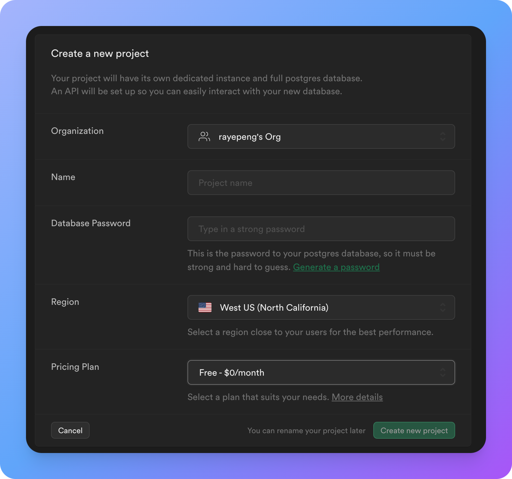 -->


获得Database的连接信息，保存下来，后续会用到


<!-- 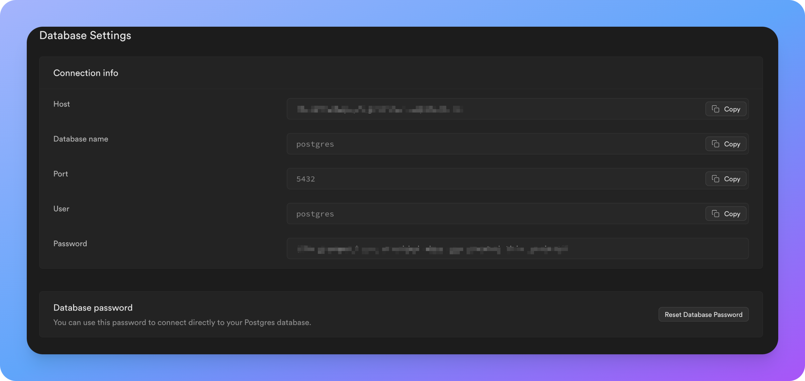 -->


 后台服务

Railway 是一个容器部署的平台，本来是最推荐的，但是我自己实验的过程中，平台的风控越来越严了，新注册的账号都不允许你从部署Github上的源码了。

但是思路打开一点，容器托管平台那么多，又不是只有你一家，你不让我用我还懒得用你呢😑。

我这里用的是 `northflank` 这个平台，唯一的门槛是需要绑定一张信用卡，搞一个虚拟的信用卡就行，相信折腾过chatGPT支付的同学都有

顺便发现了一个专供程序员白嫖的文档，收录了很多能提供免费额度的平台，生产力max！
[https://free-for.dev//?id=docker-related](https://free-for.dev//?id=docker-related)

部署过程很简单，首先fork这个代码仓库： 

[https://github.com/rayepeng/n8n-on-railway](https://github.com/rayepeng/n8n-on-railway)

新建一个Service，仓库选择你刚刚fork的


<!-- 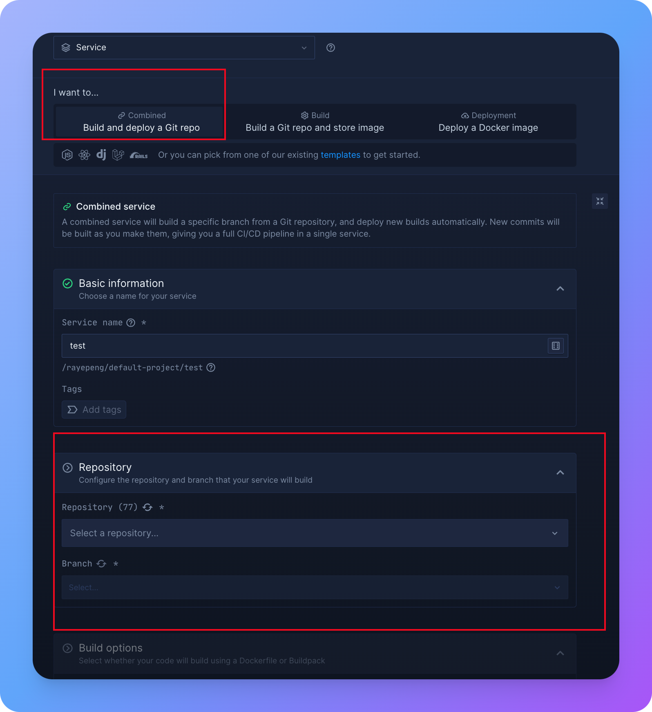 -->

 `northflank` 会自动识别出Dockerfile，并且检测出对外暴露的端口号，分配一个域名


<!-- 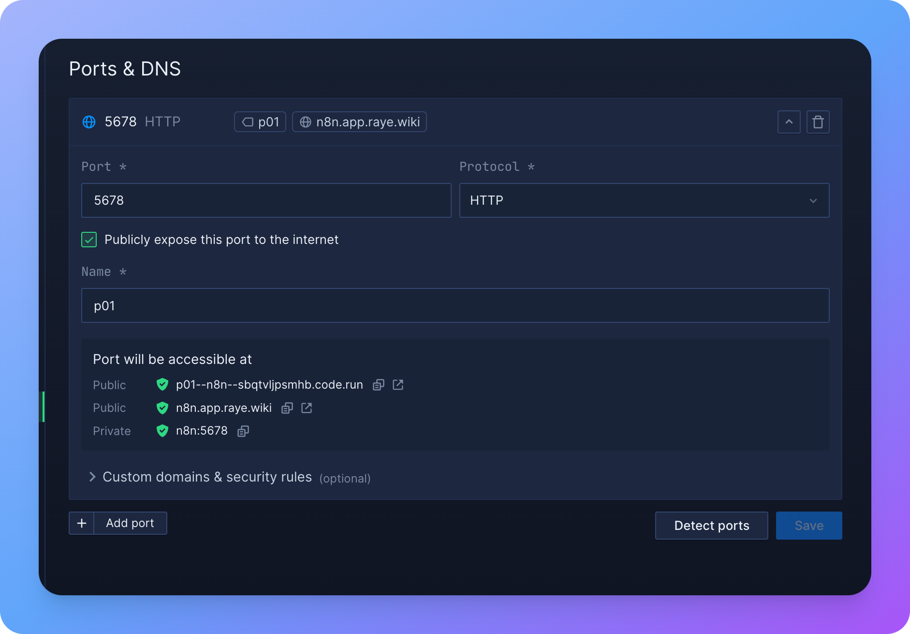 -->


等待1~2分钟，部署完成之后不出意外你就可以通过生成的域名访问你的服务了。

 环境变量配置

后台服务起来之后，还需要配置我们最开始的数据库链接，这里只需要按照如下配置来即可：
部分配置项理解：
- `DB` 开头的都是DB配置信息
- `VUE_APP_URL_BASE_API` 和 `WEBHOOK_URL` 都填写生成的域名（也可以参考后续的步骤换成你自己的）
- `N8N_ENCRYPTION_KEY` n8n用来加密的密钥，一定生成一个并妥善保管
- `EXECUTIONS_DATA_PRUNE` 定期清理数据（即运行记录之类的，不然数据库会炸）

```js
PORT=5678
N8N_ENCRYPTION_KEY=xxxxxx
VUE_APP_URL_BASE_API=https://n8n.app.raye.wiki
WEBHOOK_URL=https://n8n.app.raye.wiki
GENERIC_TIMEZONE=Asia/Shanghai
TZ=Asia/Shanghai
N8N_LOG_LEVEL=verbose
DB_TYPE=postgresdb
DB_POSTGRESDB_DATABASE=postgres
DB_POSTGRESDB_HOST=数据库URL
DB_POSTGRESDB_PORT=5432
DB_POSTGRESDB_USER=postgres
DB_POSTGRESDB_SCHEMA=public
DB_POSTGRESDB_PASSWORD=数据库密码
EXECUTIONS_DATA_PRUNE=true
EXECUTIONS_DATA_MAX_AGE=72
EXECUTIONS_DATA_SAVE_ON_ERROR=all
EXECUTIONS_DATA_SAVE_ON_SUCCESS=none
EXECUTIONS_DATA_SAVE_ON_PROGRESS=false
EXECUTIONS_DATA_SAVE_MANUAL_EXECUTIONS=false
```

如下图，配置完成后服务重启成功即可

> 注意环境变量里的URL配置，这个要填写你刚刚得到的northflank为你自动分配的，我这里是因为后面绑定了自定义域名（也就是说更换域名也需要修改这里）。因为这个域名是用作很多oAuth服务回调的，可以参考这条推文

https://twitter.com/huhexian/status/1686700703044313088?s=20

<!-- 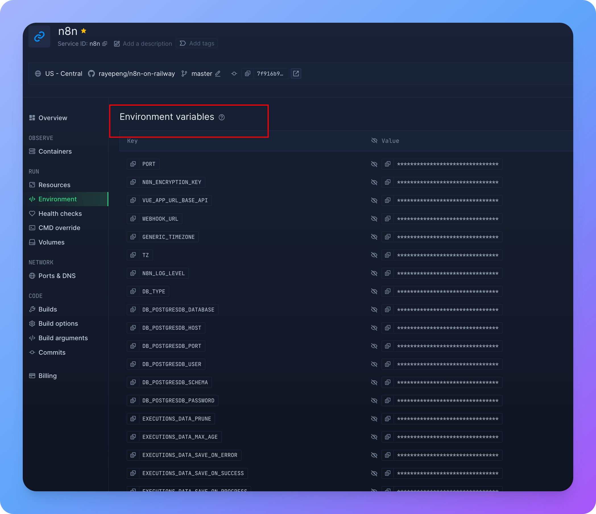 -->


 域名CDN加速

这一步可以跳过，并不影响后续的部署，只是手头刚好有一个域名，可以配合白嫖cloudfare的CDN加速服务

这里可能是唯一一步要花点钱的了，当然你手头有域名是最好的。

在腾讯云注册一个域名，比如我注册了 `raye.wiki`，再注册一个cloudfare账号， 并且添加域名（我已经添加好了）


<!-- 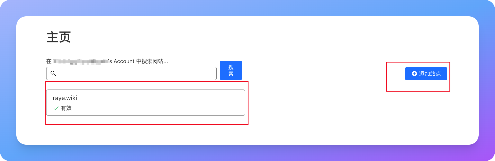 -->


Cloudfare会要求验证下这个域名是属于你的，按照指引来添加一个记录校验

然后我们更换DNS解析的服务器，可以理解为把域名解析的任务托管给cloudfare（默认是腾讯云提供的域名解析免费套餐）


<!-- 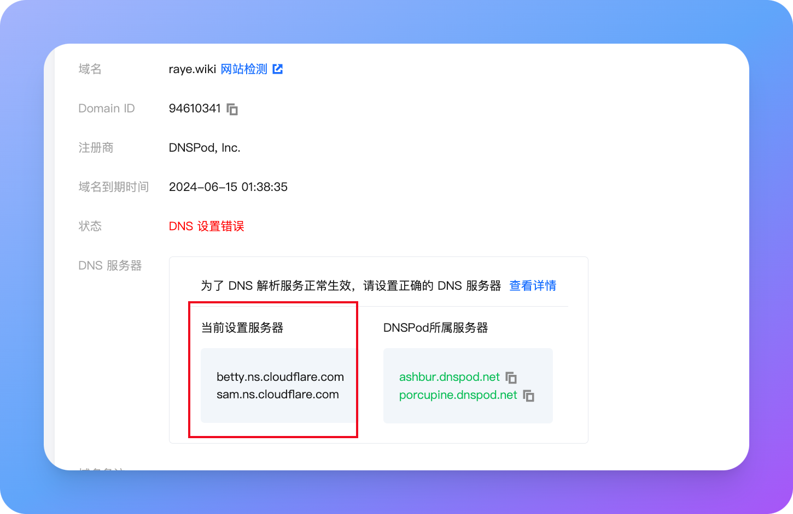 -->


这样，我们的域名就托管给cloudfare，后续可以让cloudfare来帮我们加速访问了


 域名绑定

在 `northflank` 中添加我们的域名，这里我选择分配我的子域名， `n8n.app.raye.wiki`， 添加TXT记录绑定即可


<!--  -->


<!-- 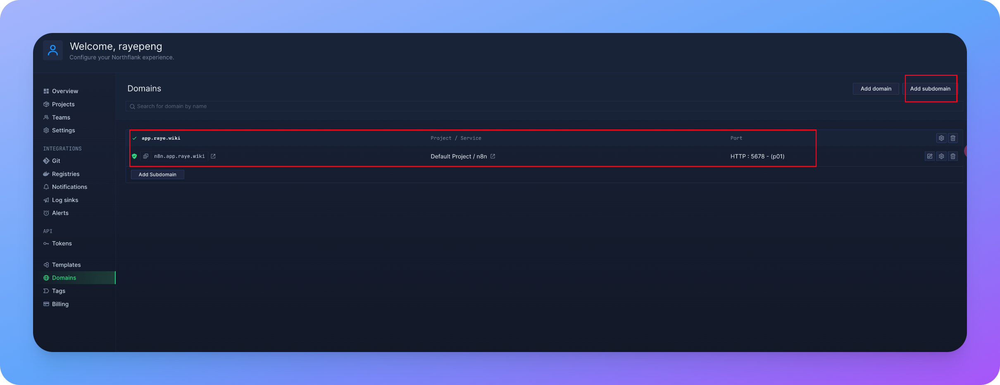 -->


初次绑定的时候可以先只开DNS，等到能正常访问了，开启cloudfare的小云朵即可实现加速


<!-- 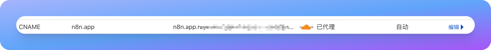 -->


(Ps. 是否开启小云朵加速这个有时候需要多次尝试下，理论上是可以用cloudfare来加速的😅）

 创建工作流

部署完成之后，不管你是绑定了自定义域名，还是由 `northflank` 分配给你的域名，都可以在浏览器中访问，注册好你的用户名和密码（毕竟这个是暴露在公网上的，并且会存储很多凭证信息）

之后就可以开始创建工作流，实现信息的自动聚合了。首先展示下我目前在跑的工作流


<!-- 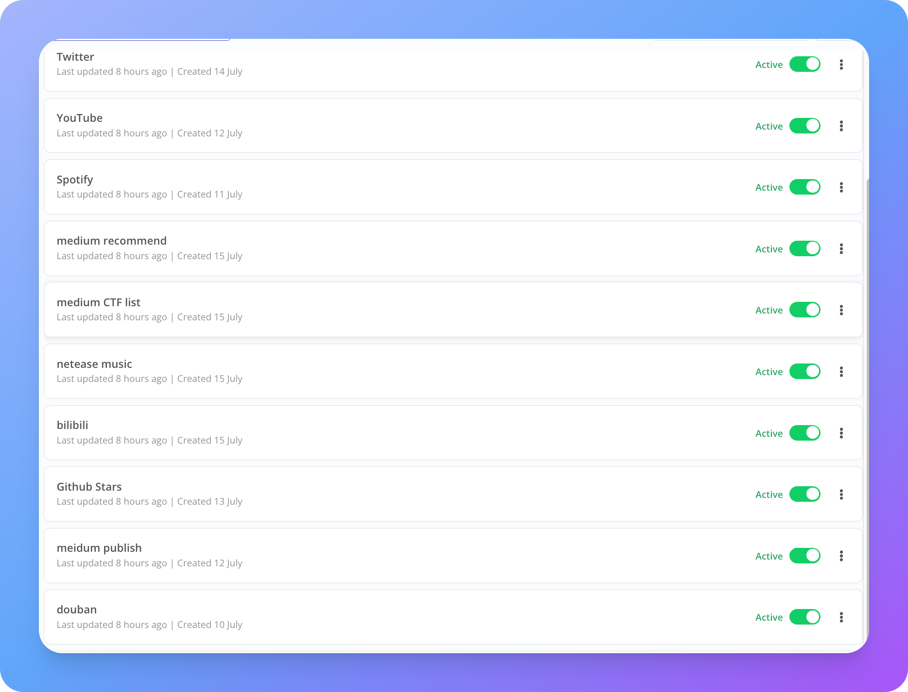 -->


> 工作流可以直接复用reorx大佬的，导入json就行了，注意要区分成不同的工作流来搞，不要都集中放在一个工作流里（我开始以为可以后来发现会执行失败

https://github.com/reorx/n8n-workflows


接下来逐个介绍一下：

 Github Stars To Telegram

Github Star的信息自动推送到tg（每隔30min）

Github用户的Star信息记录在这里：[https://github.com/rayepeng.atom](https://github.com/rayepeng.atom) 替换为你的用户名就可以了


<!-- 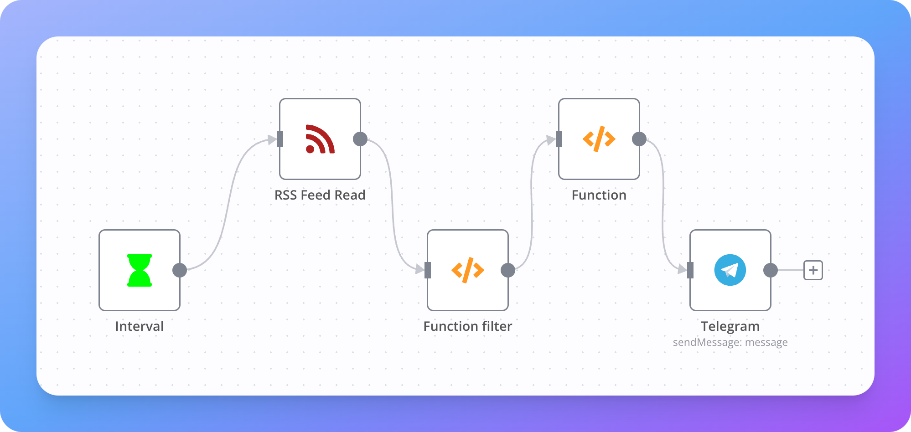 -->


 代码节点
代码节点我是复用的Reorx大佬的代码，[https://github.com/reorx/n8n-workflows](https://github.com/reorx/n8n-workflows)
但他的工作流节点都是老版的，如果运行出问题，可以考虑更新到最新的，基本兼容，只是部分API方法需要加一个 `$` 符号

顺带解释一下代码的原理：
- `getWorkflowStaticData` 是获取静态的存储数据，n8n允许存储一些数据，比如我们每次存储最新的一次uid数据，那么后续工作流运行的时候，去比较当前最新的uid，是否和上一次存储的相同，如果相同就不需要推送（从而避免重复推送）
- 节点的输入实际上就是一个json结构的item数组， `getId` 就是获取item的每一个唯一标识，这个不同场景下是需要修改的（要根据具体的json结构）
- `staticData.lastItemId` 就是在保存最新的id

```js
const staticData = $getWorkflowStaticData('global');
const lastItemId = staticData.lastItemId;

console.log('lastItemId', lastItemId);
const firstItem = items[0];
let newItems = [];

function getId(item) {
  return item.json.track.id;
}

if (lastItemId) {
  for (const item of items) {
    if (getId(item) === lastItemId) {
      break;
    }
    newItems.push(item)
  }
} else {
  newItems = [firstItem]
}

staticData.lastItemId = getId(firstItem)
return newItems.reverse()
```


 Spotify  To Telegram

Spotify本身提供了OAuth的认证方式，我们只需要根据n8n Spotify节点的指引操作一下即可，代码节点基本复用


<!-- 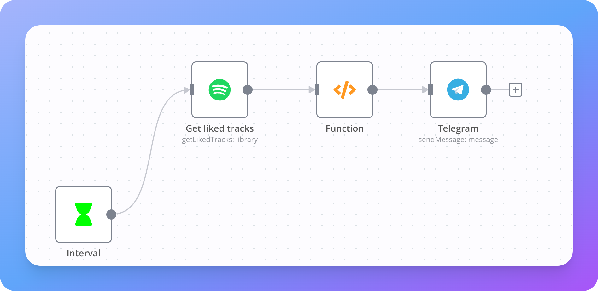 -->


 Pinboard rss To Telegram

Pinboard是一个书签管理工具，虽然收费，但是真的很好用。页面很简洁，简洁到连css样式都不加🤣

Pinboard同时提供了大量的API，比如获得最新添加的书签，因此我们只需要每隔一段时间检测是否有新增书签，即可实现推送

API如下，获取最新添加的书签
```js
https://api.pinboard.in/v1/posts/recent?format=json&auth_token=xxxxx
```


 豆瓣 To Telegram

豆瓣虽然没有任何文档提供API，但有一个隐藏的rss订阅源

访问你的个人主页，比如我的，👏🏻关注[https://www.douban.com/people/162586644/?\_i=9643158ntY72-j](https://www.douban.com/people/162586644/?_i=9643158ntY72-j)
就能获得对应的rss源了


<!-- 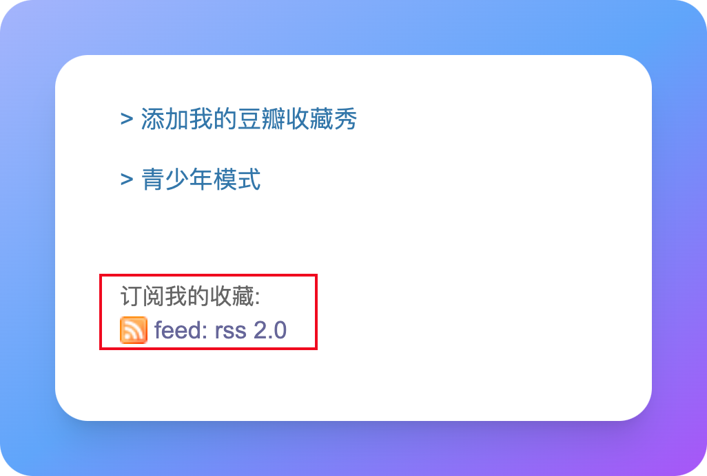 -->


 与RSS Hub联动

其实到这一步你会发现，国外的app开发者们，都很贴心地提供了API给你调用，虽然各自有护城河，但毕竟还是开放的。

然而国内的这群app们就没这么好了，反爬措施一个比一个严格，就想把用户圈子自己的城堡里。

不过还是有解决方案的，RSS Hub 就是这样一个项目，初衷是为了让万物都可变成RSS订阅（感谢开源🥰）

其中包含了网易云、哔哩哔哩这些app的RSS订阅URL，官方文档：[https://docs.rsshub.app/](https://docs.rsshub.app/)

因此，我们就能很方便地，自己部署一个RSS Hub，并且实现相关app的信息聚合！

 RSS Hub部署

官方文档其实已经提供了好几种部署方式，[https://docs.rsshub.app/install/docker-jing-xiang](https://docs.rsshub.app/install/docker-jing-xiang)

但我们依旧采用白嫖的方式！

我一开始直接用 `northflank` 来部署的，但是由于资源不足会导致后台OOM。于是切换到了另一个serverless平台：[https://www.koyeb.com/](https://www.koyeb.com/)

部署方式其实和n8n部署很相似的，只需要创建新项目，并且选择RSS Hub的Github仓库部署即可

部署结果如图（域名打马赛克是不让你白嫖我的服务 🐶：


<!-- 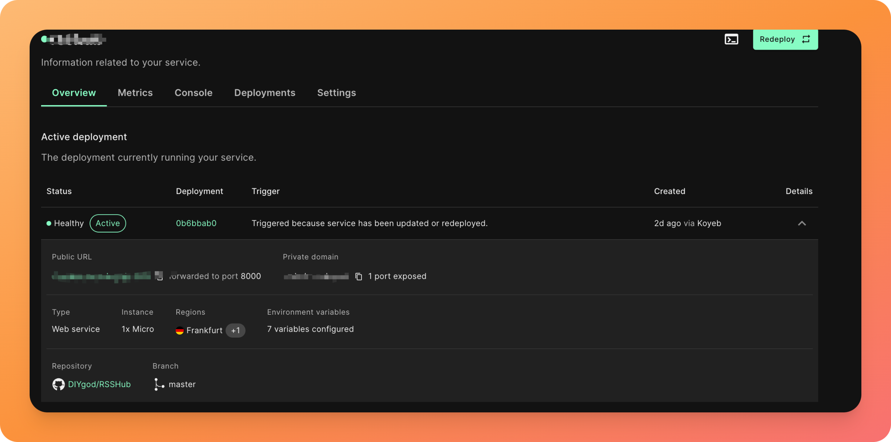 -->


 B站 To Telegram

部署成功之后，即可根据RSS Hub的文档，获得自己投币的视频（注意需要公开）

比如我的投币视频链接：

https://rsshub.app/bilibili/user/coin/261764405

这样就可以实现B站的投币视频的推送啦（点赞和收藏视频还是要隐藏的，毕竟有很多小姐姐😅


 网易云 To Telegram

网易云则有一点点复杂，因为需要你的登录态cookie

获得cookie的流程可以参考：[https://github.com/acloudtwei/NewMusic163%E6%B5%8F%E8%A7%88%E5%99%A8%E6%8A%93cookie](https://github.com/acloudtwei/NewMusic163%E6%B5%8F%E8%A7%88%E5%99%A8%E6%8A%93cookie)

简单介绍下：
1. 获得歌单链接：


<!-- 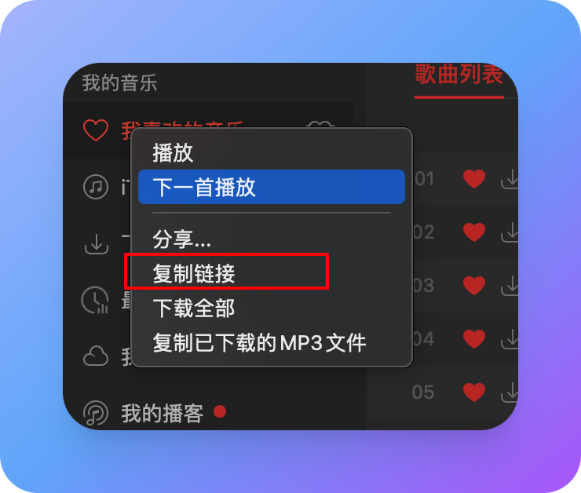 -->

2. 浏览器打开登录，开发者工具找到这个值 `MUSIC_U` 即可


<!-- 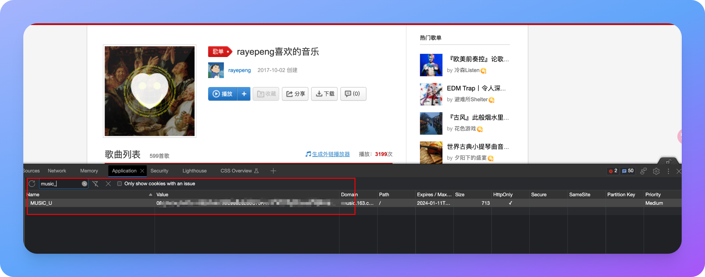 -->


3. 在serverless平台，配置好对应的环境变量 `NCM_COOKIES `


<!-- 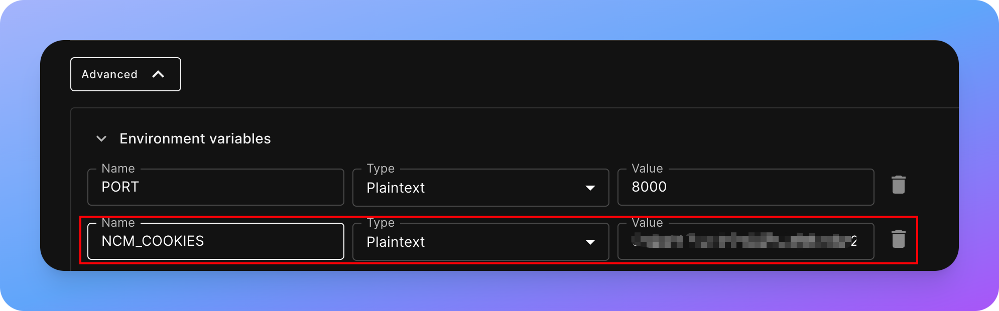 -->


此时就配置完成了，当你喜欢一首歌的时候，会自动推送到Telegram


 附：telegram相关配置
 创建telegram频道

点击New Channel, 有手即可：

<p align="center">
  
</p>

 创建 telegram机器人并添加到频道管理员

本质上是通过机器人来推送信息的，因此我们需要创建属于自己的机器人

方法也很简单，搜索BotFather，start开始，取名就行了

创建完会获得一个机器人的Token，这个要保存好。（虽然忘记了也可以通过BotFather找回）

<p align="center">
  
</p>

创建完成之后，添加到频道管理员即可（可以把删除消息的权限关了，太懒了不截图了）

 chatid获取

这一步是真的稍稍有点复杂，我研究了半天。

1. 首先从这里进入频道管理
<p align="center">
  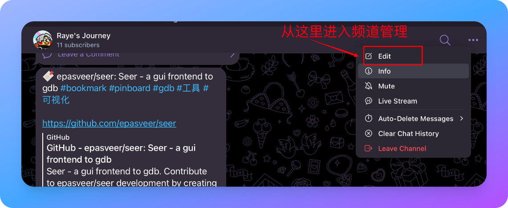
</p>

2. 点击右上角的Edit编辑，首先公开频道（后面可以隐藏）


<!-- 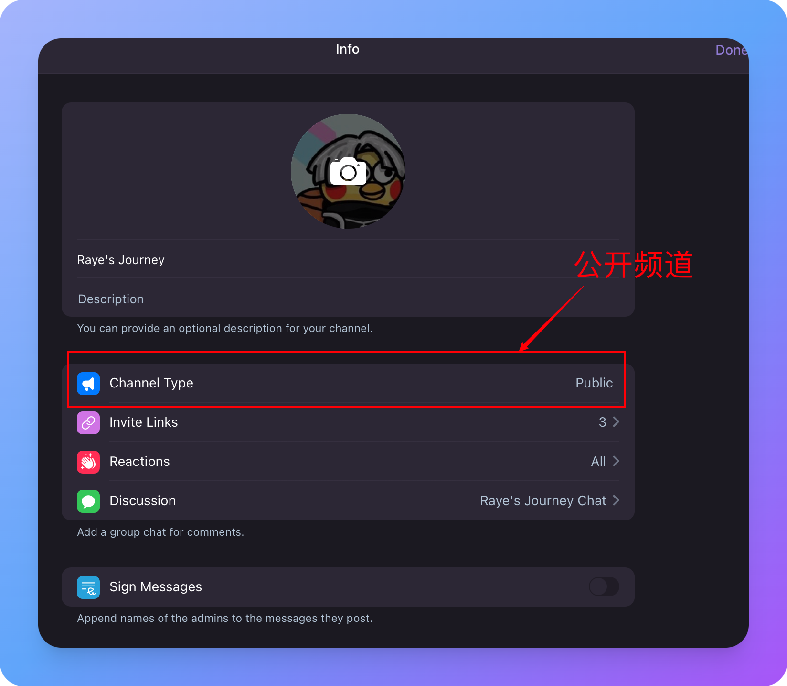 -->


这个时候就已经你的频道就已经有一个独一无二的名字了，直接用这个作为Telegram的节点做推送也可以
但如果你不想公开的话，继续往下看

3. 通过API触发一条消息

将Token、channel name替换成你的，发送一条消息

```js
https://api.telegram.org/bot{Token}/sendMessage?chat_id=@{channelname}&text=test
```

此时获得相应内容，chatid 就获得了，最后再把channel给隐藏起来，就完成了

```json
{
    "ok":true,
    "result":{
        "message_id":591,
        "sender_chat":{
            "id":xxxxxxx,
            "title":"Raye's Journey",
            "username":"RayeJourney",
            "type":"channel"
        },
        "chat":{
            "id":xxxxxxxxx,
            "title":"Raye's Journey",
            "username":"RayeJourney",
            "type":"channel"
        },
        "date":1689602624,
        "text":"test"
    }
}
```


 参考

主要是Refer了Reorx大佬的两篇文章
[https://reorx.com/blog/sharing-my-footprints-automation/](https://reorx.com/blog/sharing-my-footprints-automation/%e5%89%8d%e8%a8%80)
[https://reorx.com/blog/0-cost-self-hosted-n8n-with-railway-and-supabase/](https://reorx.com/blog/0-cost-self-hosted-n8n-with-railway-and-supabase/)

<!--  -->