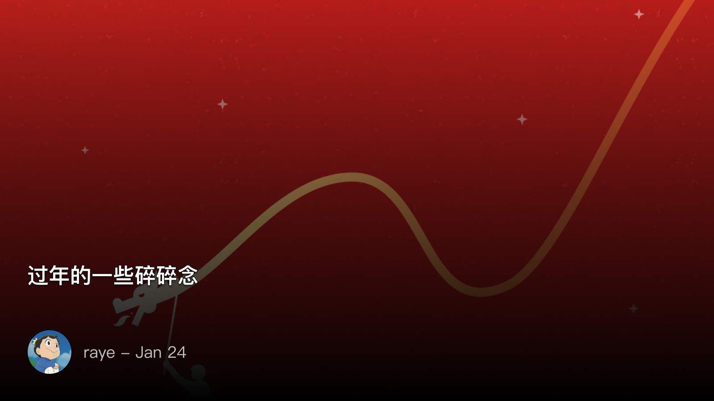
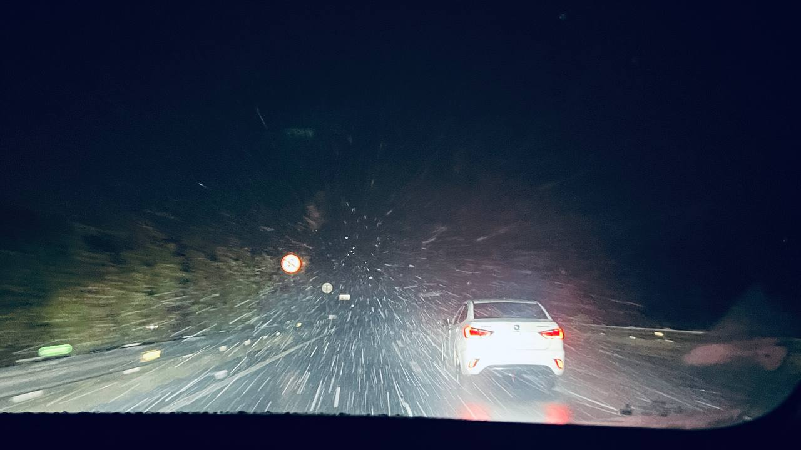
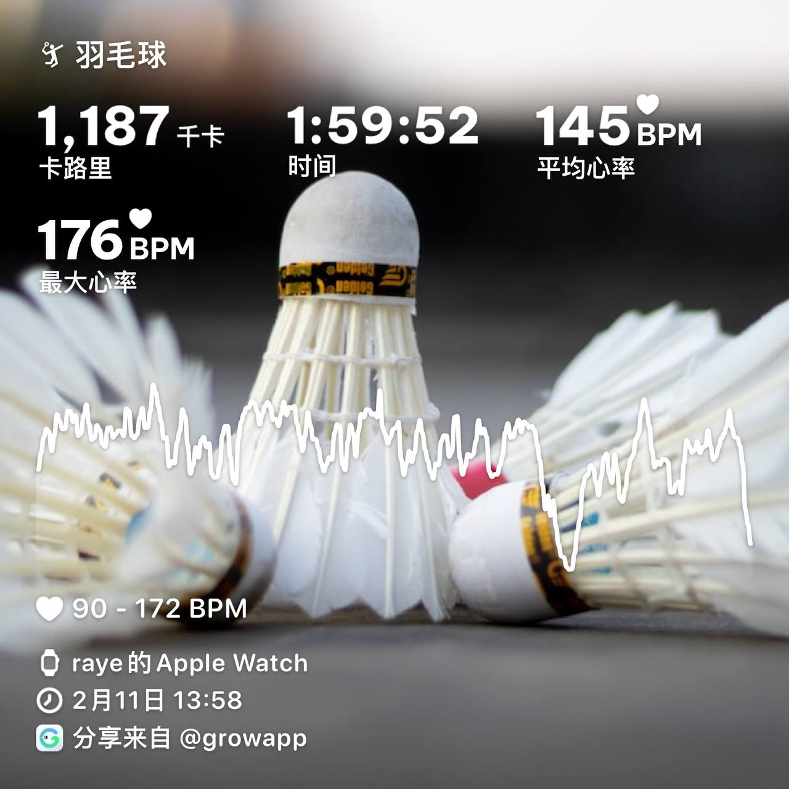
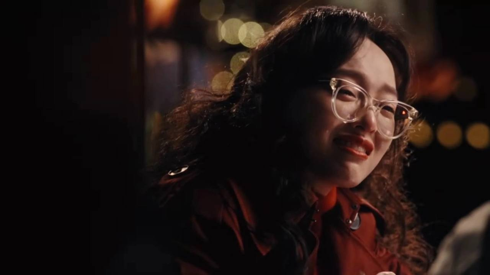
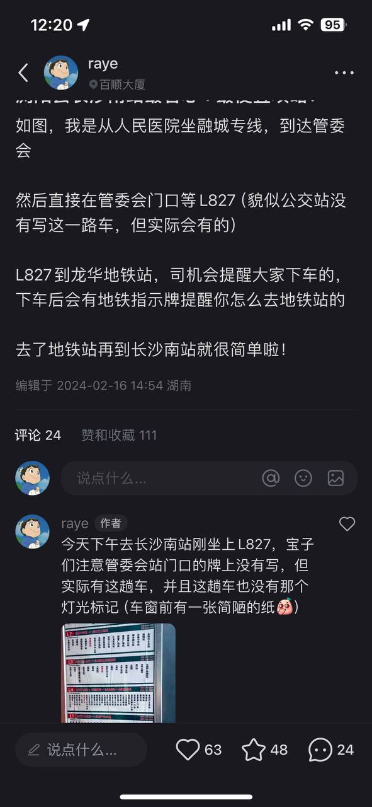
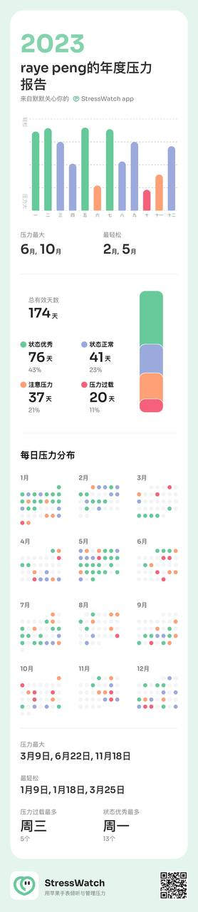

 过年的一些碎碎念

<!--  -->

 回家

今年（哦其实应该算是去年）是比较反感回家的，所以算是一直拖到了工作的最后一天才回去。回家的旅程稍有些波澜，高铁晚点半小时，到长沙后又开始下雪了，所幸接我的司机挺靠谱的，长沙回老家的路上，第一次意识到高速公路原来是没有路灯的

可惜手机随手拍的太差了，那种恐怖的氛围：高速路的前方没有任何一辆车，漆黑的夜空中，大雪扑面而来，孩子从没见过这种世面😭

<!--  -->

所幸还是平安回家，一个小时左右就到达市区了。原来曾经只能远远观望的隧道早已修通，长达4.5公里！询问司机才得知老早就开通了，好吧，确实是我孤陋寡闻了

 一些小事

年前两天也没多少事，大年三十上午又约了球友去打羽毛球，这回没想到是一个体育生已经高三了，被他虐的体无完肤（， 同时作为过来人，也了解了下他面临的处境，给了他一些说不上有什么用的学习建议吧

我妈还跟我提到一件事，说我国庆回老家的时候，不是叫上了曾经的一个小学同学一起打羽毛球，打完后正常A了场地费和球费嘛。结果那个小学同学的妈妈有一次路上碰见我妈，刻意提起这件事，还要特地强调一句就我一个人赚钱了。。

我开始还没反应过来，什么叫就我一个人赚钱了。后来才意识到，这个言下之意不就是觉得我太小气了吗… 但我在深圳生活这么久，A钱已经成了一个习惯，结果到了你们这，就成了指摘人的一个把柄..

这件事让我觉得很无语，于是过年就懒得联系那个小学同学了。我宁愿去小红书上发帖找志同道合的一些朋友

稍微激进一点想，我感觉打败微信的新产品已经出来了，就是小红书。微信永远不会被另一个熟人社交产品给打败，只是当人们都开始讨厌熟人社交，讨厌那些背后的利益计算的时候，陌生人社交反而是一种更好的选择

好了不说这些了，在老家玩烟花还是很开心的

<video>
  <source src="ipfs://QmPZFzkYpYyn4JnKFp2dY1LN9WPZm6Z9gvacRoaz6ojAwJ" type="video/quicktime" />
</video>

大年初一第一天，球馆免费，人还少，于是又跑去打球了😁，正好约到了一位技术水平相当的球友，两个人一直连续单打了俩小时，大汗淋漓

<!--  -->

过年还差点出了一次车祸…本来我打完球好好地骑车回家，谁曾想一辆出租车突然停在我前面开始下客…司机完全没看后视镜，于是我就撞上了刚打开的车门，所幸没有出大事，左手小拇指擦破了皮，当我刚反应过来的时候，出租车已经跑走了..😭

 原生家庭

以前我还没觉得原生家庭对于一个人有多么大的影响，这次回家突然就意识到，我跟我妈在某些方面也太像了（但是我妈的性格没有我那么急，可能这一点是受我爸的影响吧）

同时还有一点感想，我们都讨厌那些过年走亲戚的时候，被他们问东问西。其实归根结底，他们无非就是想从你这里找到一点优越感罢了。当他们无法把你比下去的时候，他们甚至都不愿意开口问你（🤣，比如目前亲戚里还没有几个大学考的比我好，工作比我好的，所以过年基本没人会问我这些…）

 其他

 繁花

过年剩余的时间就在家里追繁花了，汪小姐这一幕又哭又笑演的太好了啊！

<!--  -->

 龙脉常歌

以及年前通关了《龙脉常歌》（好吧其实是XGP马上就要退库了），略显平淡地剧情，却依旧阻挡不了我泪流满面

<!--  -->

 小红书帖子：坐车攻略

分享了一条最便宜省心的坐车攻略，没想到第一次被这么多人点赞和评论，果然当你用真诚的态度去分享有用的事情或者攻略，都是一件很棒的事情！（又想起了那位专门教大家如何坐高铁坐飞机这些生活攻略的up主，这些才是必备的生活技能）

<!--  -->

 app推荐：StressWatch

推荐一款app，stresswatch，通过计算心跳HRV来评估压力，自我认为还是挺准的

<!--  -->
