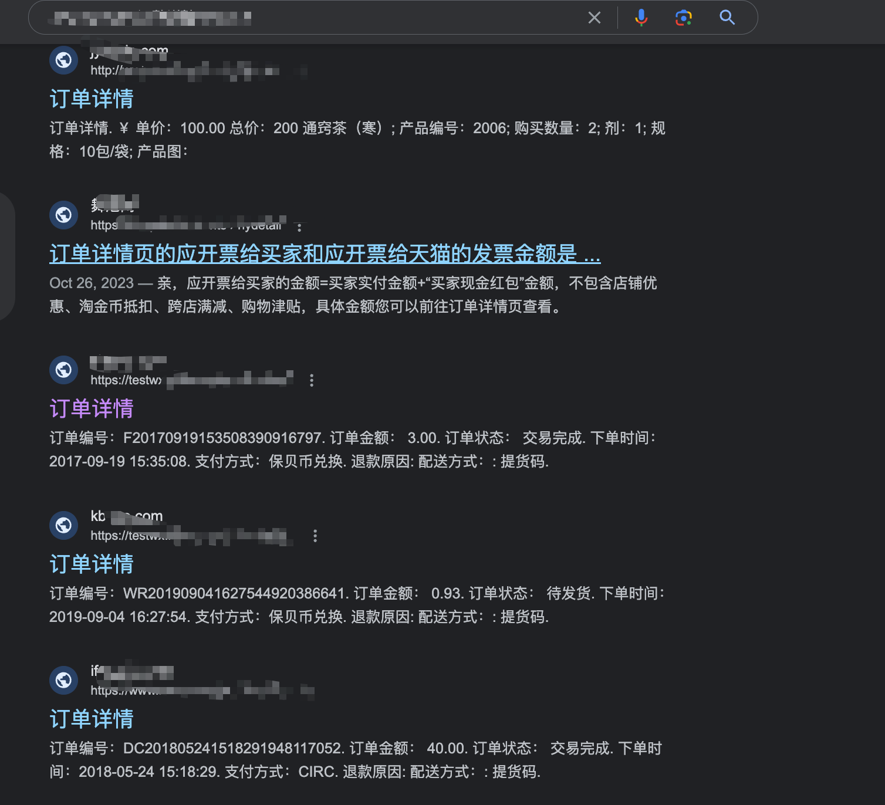

 逻辑漏洞学习总结（一）


实战经验还是比较少，但是打CTF（水比赛）的经历很多🐶，感慨自己对于漏洞的理解不够深刻，于是准备开始从逻辑漏洞先开始总结

参考大佬们的经验，简单总结了下逻辑漏洞的思维导图


<!--  -->


 一些常见的逻辑漏洞分析

 任意密码找回/任意手机号修改

经典流程：
验证old手机号/old密码 -> 提供新的手机号/密码 -> 提交修改

第一步，验证原有手机号或者密码，如果可以修改返回的response包，那么就可以绕过这一步骤，

此时如果第三步没有验证第一步认证是否成功，则可以任意绑定手机号/修改任意密码

 并发抽奖/签到

抽奖、签到并发问题，通过多次重放可以累计登录天数，获得多个抽奖券等

一般的解决办法都是通过CAS操作来进行的，CAS操作包含三个参数：
1. 内存位置V
2. 期望的原值A
3. 新值 B

CAS首先检查V种的当前值是否和A匹配，如果匹配，则更新为B，否则不作操作。这里的整个操作都是原子的，从而保证同步

 前端JS

多翻翻前端JS，可以找到很多点，如：
- 隐藏的接口
- js source map 文件

主要参考这篇：
[https://xz.aliyun.com/t/9453]

 登录态泄露

在一些H5场景、小程序场景中，很多开发者偷懒，其实也是因为登录态的设计过于复杂，导致简单的通过openid等方式直接验证

这种案例就比较多了，多见于微信生态体系下

 报错页面

报错页面也是可以返回很多信息的，最常见的就是CTF种通过报错页面来实现模版注入

实战场景中，报错页面可能会泄露很多敏感的信息，比如登录态🐶(还真遇到过


 Google hacking扩展

知道了这么多逻辑漏洞，怎么去测试呢？

通过Google hacking语法能找到很多的站点，一个个测就好了，比如我们找支付功能的，就可以通过这样搜素

```bash
inurl:m intitle:订单详情 inurl:id=
我的订单 订单详情
inurl:order 订单详情
inurl:wap intitle:订单详情
inurl:m intitle:订单详情
inurl:php intitle:订单详情
title:订单详情 手机号
site:.com title:订单详情
title:订单详情 身份证
```


<!--  -->


通过这个思路就能找到很多实际的支付站点，并且一个个去验证测试

如果漏洞比较通用的话，就可以编写下poc集成到xray或者其他被动扫描工具了

预计下一篇就来分享下对这些站点的挖掘🤔，先水完这一篇好了

 Reference

- [https://xz.aliyun.com/t/12948]
- [https://cloud.tencent.com/developer/article/1591315]


<!--  -->