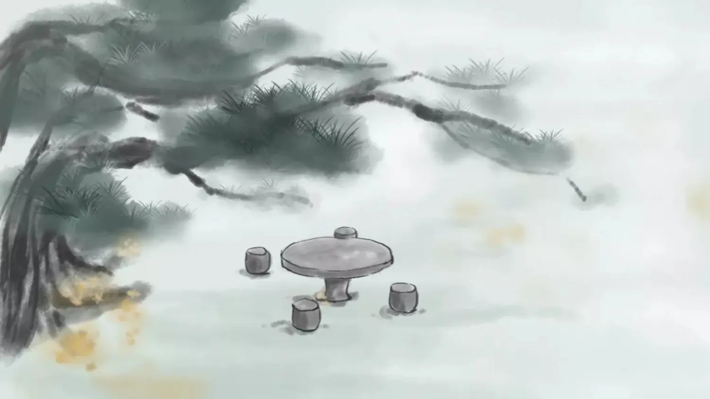
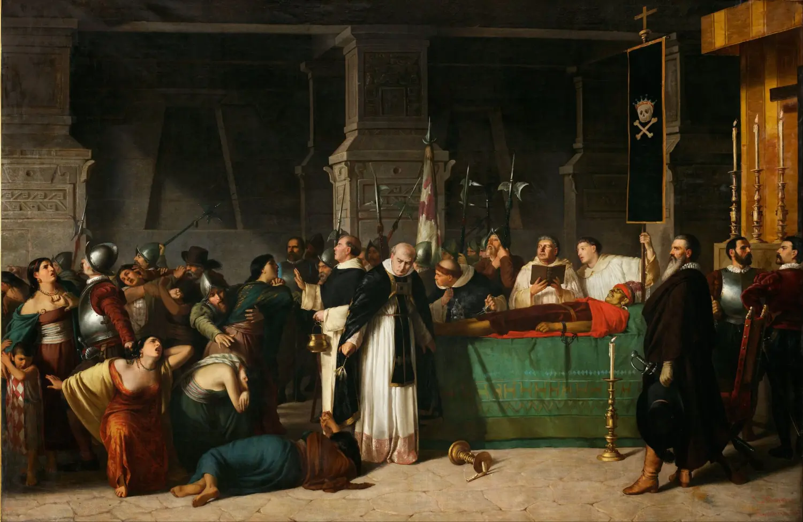
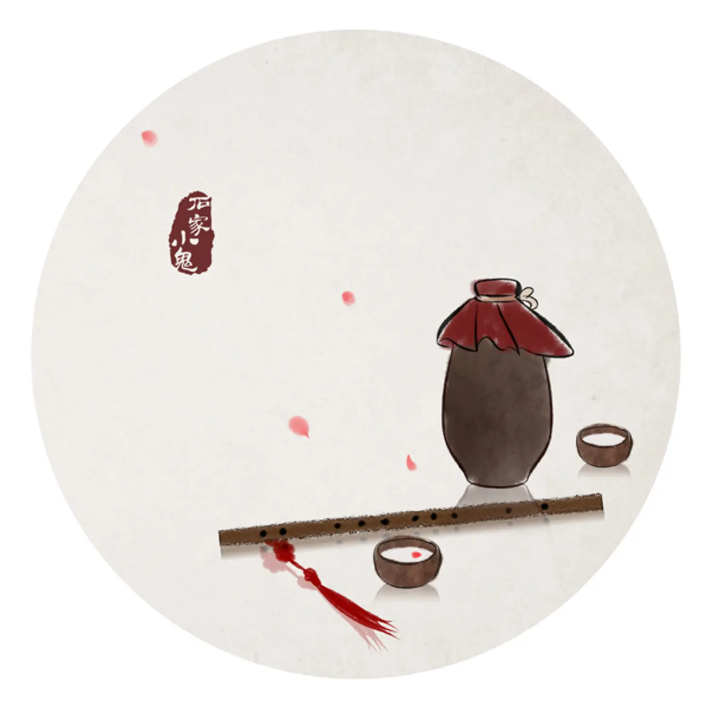

 随笔 1.24

> 今年年初写的旧文了，重新修饰了下再发出来，重温当时的心境，最近也很少写了

<!--  -->

经常性会出现啥都不想干的情况，似那黄鹤一去不复返，只留下脑海的白云千载空悠，对任何事情，读书、研究、游戏都提不起兴趣，每当此时静坐于窗下灯前，想起王摩诘所谓雨中山果落，灯下草虫鸣，心中总会生出一股暖意，原来跨越千年的时光，我与王维的心境就交汇于这十个字中。若真有平行时空，不知他的心中是否会突然一悸，接受到我这来自千年之后的信号呢？

恐怕是必然不可能的，毕竟物理学的祖父悖论怎么可能轻易逾越呢？但是歌曲却可以跨越人的心灵，今日偶然听到一首 《ocean eyes》，竟然是很久之前添加收藏的，歌手空灵悠远的音调，让我忍不住单曲循环了好一阵子，尽管听英语歌这么多年了，尽管英语文章已经看的大差不差了，可是在歌这一层，却总是无法真正读懂，那诞生于国外的高音女歌手嗓音中的律动，故只能按照我自己所处的环境和心境来解读了。那在我必是一种悲凉，我仿佛看到了一双跨越千年的目光，穿过迷雾茫茫的大海，那眼神中传达出的空旷哀伤，让我沉醉其中。

<!--  -->

但我这理解又不一定准确，可我也懒待去寻找真正的解读，何必事事总要去细细求证呢？毕竟各人有各人所处之环境，不仅仅是心灵所处之环境，我们千百年来生活的地理环境，也似乎决定了些什么。否则何以解释是西班牙殖民者带上枪炮、钢铁和天花病毒，去感染印第安人呢？最近读了一大半的《枪炮、病菌与钢铁》，作者不仅从实证、逻辑推理的角度追本溯源，更驳斥了西方一直以来的种族决定论。

<!--  -->

其实不然，早在公元前，咱们的农民起义领袖陈胜就已经喊出了那句王侯将相，宁有种乎的口号。这国外能比吗，那显然是不能的。但陈胜的局限性就在于，既然不是种族决定，那是什么决定呢？可能这位农民起义领袖也顾不上许多，因为暴虐的大秦朝还等着他去推翻呀。起义的前夕，他是否能悠然入睡呢？

都说成大事者，泰山崩于前而面不改色，刘慈欣刻画的罗辑博士，在被托付于人类危机的重担中，却依然能翩翩然享乐。若此重任改嫁到我身上，恐怕要么我将如同诸葛丞相一样，五月度泸，深入不毛，夙兴夜寐，攘除奸凶，断不敢像罗博士一样，手持暗影精灵，谈笑间令eto组织灰飞烟灭吧（笑）。

<!--  -->

那些弥漫充斥于脑海中的各路想法，最后终不过是晓来百念皆灰尽，省有残灯影。如苏子，对一壶酒，一溪云，如王摩诘，对一山雨，一鸣虫，如我？似乎没啥好对的了，那也就写完了

<!--  -->

